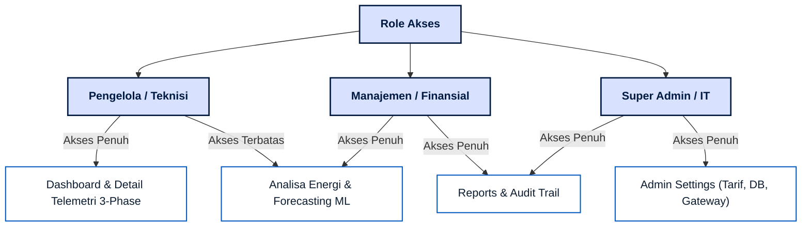
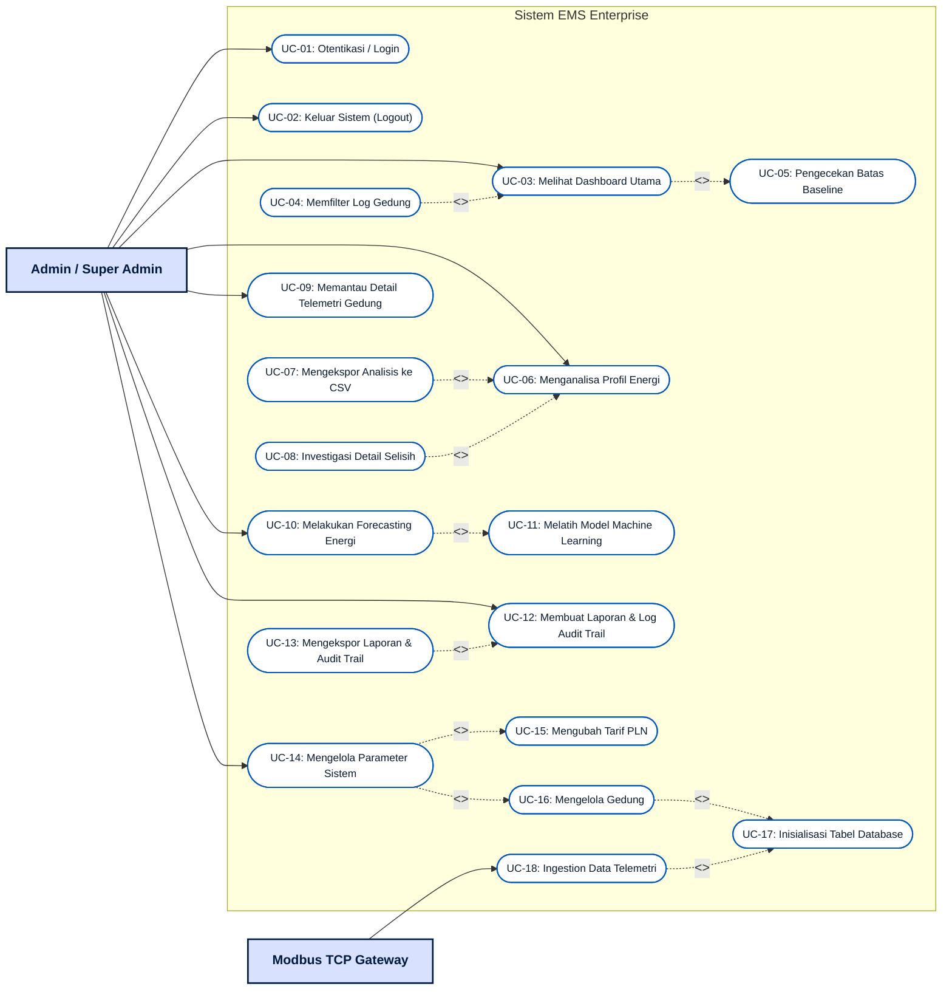
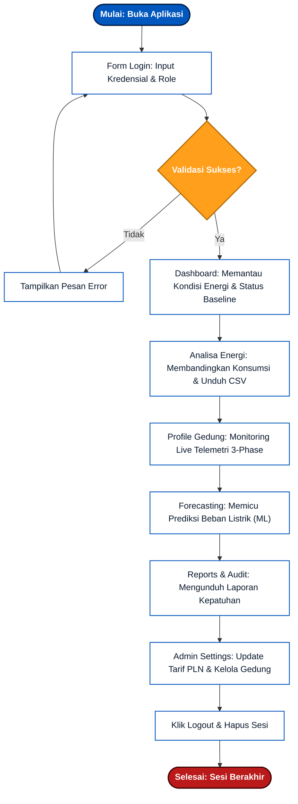
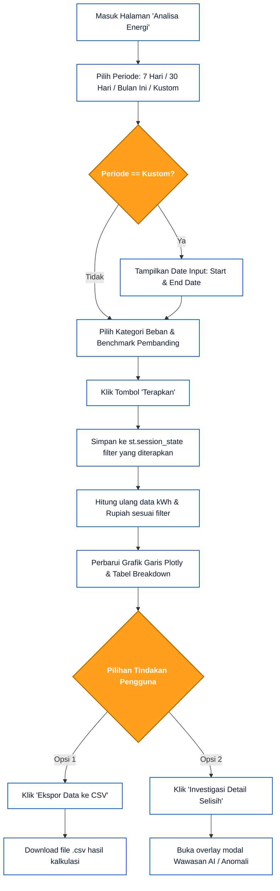
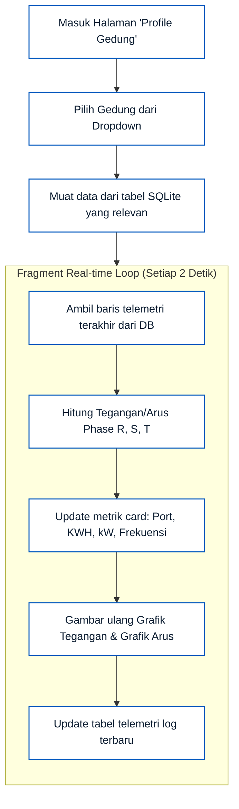
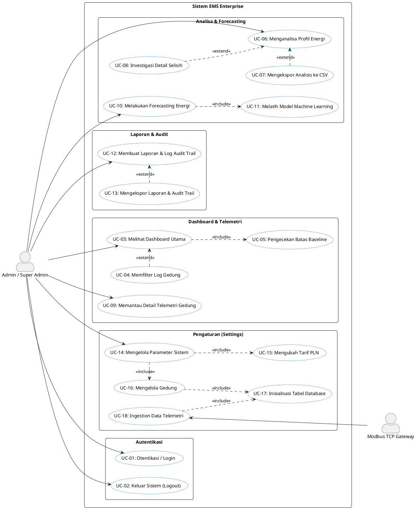
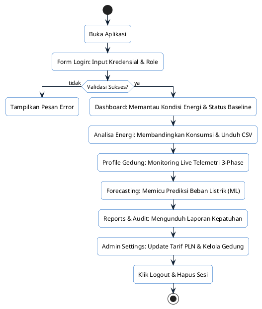
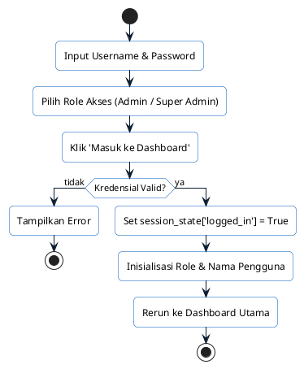
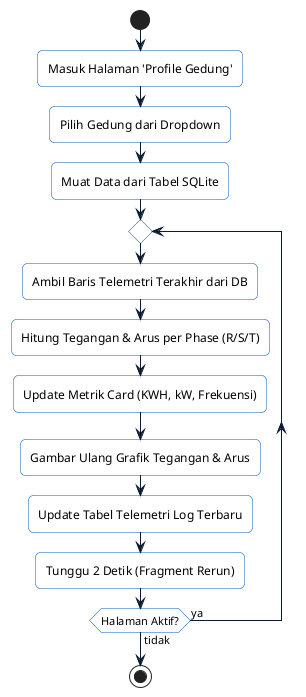
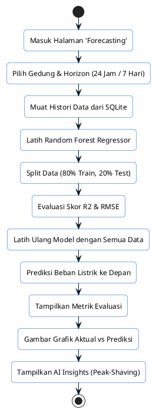

# Hasil Analisis Sistem: User Requirements, Use Case, dan User Flow (EMS Enterprise)

Dokumen ini menggabungkan hasil analisis kebutuhan pengguna, diagram use case, dan aliran pengguna (user flow) untuk memudahkan penyusunan laporan proyek atau bab skripsi Anda.

---

## BAB 1: ANALISIS KEBUTUHAN PENGGUNA (USER REQUIREMENTS)

Tahap ini memetakan perbedaan kebutuhan informasi dan fungsi sistem berdasarkan peran pengguna (*user personas*) di lingkungan operasional gedung.

### 1.1 Matriks Kebutuhan Peran Pengguna
Pengguna sistem dibagi menjadi tiga aktor dengan fokus dan tingkat kedetailan informasi yang berbeda:

| Dimensi Perbandingan | Pengelola Gedung (Teknisi / Operator Fasilitas) | Manajemen Gedung (Manajer Energi / Direksi / Keuangan) | Super Admin (IT / System Administrator) |
| :--- | :--- | :--- | :--- |
| **Fokus Utama** | Operasional harian di lapangan, kestabilan jaringan listrik, dan respon cepat terhadap gangguan/alarm. | Efisiensi biaya, pencapaian target efisiensi energi (KPI), audit finansial, dan perencanaan anggaran (budgeting). | Konfigurasi sistem dasar, keamanan data, integrasi perangkat Modbus, dan pemeliharaan database. |
| **Kebutuhan Informasi** | - Nilai tegangan (V) & arus (A) per phase.<br>- Status koneksi gateway Modbus.<br>- Peringatan *overshoot* beban secara real-time. | - Total konsumsi akumulatif (kWh).<br>- Estimasi biaya tagihan (Rupiah).<br>- Laporan kepatuhan audit (BPK/Internal).<br>- Tren proyeksi beban (Forecasting). | - Konfigurasi tarif PLN.<br>- Pemetaan alamat IP/Port Modbus.<br>- Manajemen database dan log audit sistem. |
| **Tingkat Detail Data** | Sangat detail, bersifat teknis, dan berorientasi pada waktu nyata (*seconds/minutes*). | Agregat (ringkasan), berorientasi finansial, dan jangka panjang (*daily/monthly/yearly*). | Parameter konfigurasi sistem dan integritas infrastruktur data. |

### 1.2 Rekomendasi Pemisahan Hak Akses (Role-Based Access Control)
Untuk pengembangan sistem lebih lanjut, diusulkan pembagian hak akses menu antarmuka sebagai berikut:



---

## BAB 2: SPESIFIKASI USE CASE (USE CASE SPECIFICATIONS)

Use Case memetakan interaksi aktor (manusia maupun sistem eksternal) terhadap fungsionalitas yang disediakan oleh dashboard EMS Enterprise.

### 2.1 Identifikasi Aktor (Actors)
1. **Admin / Super Admin (Aktor Utama):** Pengguna yang memantau konsumsi energi, melakukan analisis, menggunakan fitur forecasting, mengekspor laporan, serta mengubah pengaturan dasar sistem.
2. **Modbus TCP Gateway (Aktor Pendukung):** Sistem/perangkat eksternal yang mengirimkan data telemetri listrik (*Active Power*, *Energy*, *Voltage*, *Current*, *Frequency*) dari masing-masing gedung ke database secara periodik.

### 2.2 Daftar Use Case
Berikut adalah daftar fungsionalitas sistem yang dipetakan sebagai Use Case:

* **UC-01: Otentikasi / Login:** Mengakses sistem menggunakan username, password, dan memilih role akses yang sesuai.
* **UC-02: Keluar Sistem (Logout):** Mengakhiri sesi aktif pengguna dan mengunci kembali aplikasi.
* **UC-03: Melihat Dashboard Utama:** Memantau ringkasan real-time total konsumsi (kWh), estimasi biaya (Rp), status baseline (Normal/Warning), grafik konsumsi harian, distribusi beban, dan log aktivitas Modbus.
* **UC-04: Memfilter Log Gedung:** Menyaring tabel aktivitas gedung di dashboard berdasarkan nama gedung atau nomor port Modbus.
* **UC-05: Pengecekan Batas Baseline:** Sistem secara otomatis mendeteksi apakah beban melebihi target batas baseline harian yang diatur.
* **UC-06: Menganalisa Profil Energi:** Membandingkan pemakaian energi antar periode waktu dengan benchmark pembanding (minggu lalu, tahun lalu, atau target baseline).
* **UC-07: Mengekspor Analisis ke CSV:** Mengunduh tabel perbandingan analisis profil energi ke file format `.csv`.
* **UC-08: Investigasi Detail Selisih:** Menampilkan overlay dialog analisis wawasan anomali energi berdasarkan log HVAC dan telemetri.
* **UC-09: Memantau Detail Telemetri Gedung:** Melihat status koneksi port Modbus, akumulasi kWh, beban kW saat ini, serta grafik tegangan dan arus listrik 3-phase per phase (R/S/T).
* **UC-10: Melakukan Forecasting Energi:** Membuat prediksi beban listrik ke depan menggunakan model regresi *Random Forest*.
* **UC-11: Melatih Model Machine Learning:** Proses pelatihan algoritma regresi dengan membagi data latih/uji (80:20) secara otomatis sebelum membuat hasil prediksi.
* **UC-12: Membuat Laporan & Log Audit Trail:** Menampilkan laporan keuangan BPK, laporan efisiensi bulanan, rekapitulasi konsumsi gedung, serta log aktivitas audit trail.
* **UC-13: Mengekspor Laporan & Audit Trail:** Mengunduh dokumen laporan atau log audit trail dalam bentuk file CSV.
* **UC-14: Mengelola Parameter Sistem:** Mengakses menu administrasi parameter.
* **UC-15: Mengubah Tarif PLN:** Memperbarui tarif listrik dasar (Rupiah/kWh).
* **UC-16: Mengelola Gedung:** Menambah gedung baru (mengisi nama & port Modbus) atau menghapus gedung yang ada.
* **UC-17: Inisialisasi Tabel Database:** Pembuatan skema tabel telemetry baru di SQLite ketika gedung baru didaftarkan.
* **UC-18: Ingestion Data Telemetri:** Proses perekaman data telemetri berkala ke SQLite oleh perangkat Modbus eksternal.

### 2.3 Diagram Use Case (Mermaid)



---

## BAB 3: ALIRAN PENGGUNA (USER FLOWS)

User Flow menggambarkan langkah interaksi logis pengguna saat bernavigasi dari satu fungsi ke fungsi lainnya.

### 3.1 Alur Navigasi Utama (Global User Flow)



### 3.2 Alur Detail Per Fitur (Detail Flows)

#### A. Alur Otentikasi & Login (Authentication Flow)
1. Pengguna membuka antarmuka aplikasi Streamlit.
2. Pengguna memasukkan username, password, dan memilih role akses (Admin / Super Admin).
3. Pengguna menekan tombol "Masuk ke Dashboard".
4. Sistem memeriksa validitas data:
   * Jika valid: Mengeset variabel sesi login, memuat profil pengguna, dan menampilkan halaman utama (Dashboard).
   * Jika salah: Menampilkan pesan kesalahan dan menolak akses masuk.

#### B. Alur Analisa Profil Energi (Energy Analysis Flow)
1. Pengguna berpindah ke halaman **Analisa Energi**.
2. Pengguna menyesuaikan parameter penyaringan (Periode Analisa, Kategori Beban, dan Pembanding).
3. Jika periode yang dipilih adalah "Kustom", sistem menampilkan komponen input tanggal mulai dan tanggal selesai secara dinamis.
4. Pengguna menekan tombol "Terapkan".
5. Sistem menarik data historis dari database SQLite, melakukan kalkulasi statistik konsumsi (kWh) dan biaya (Rupiah), kemudian menggambar ulang grafik garis Plotly serta memperbarui tabel breakdown di layar.
6. Pengguna memiliki opsi untuk:
   * Mengekspor data ke CSV (mengunduh file).
   * Membuka modal investigasi detail guna melihat wawasan AI mengenai anomali daya.



#### C. Alur Pemantauan Detail Telemetri (Building Profile Flow)
1. Pengguna memilih menu **Profile Gedung**.
2. Pengguna memilih gedung spesifik dari menu pilihan (*dropdown*).
3. Sistem secara otomatis menjalankan loop perulangan setiap 2 detik (*fragment rendering*).
4. Di setiap perulangan, sistem memuat data baris telemetri terbaru dari tabel SQLite gedung terkait, memperbarui angka-angka metrik utama, dan merender ulang grafik visualisasi tegangan serta arus listrik 3-phase di antarmuka pengguna.



#### D. Alur Forecasting Energi (Machine Learning Flow)
1. Pengguna masuk ke halaman **Forecasting**.
2. Pengguna memilih gedung sasaran dan durasi prediksi (24 Jam atau 7 Hari ke depan).
3. Sistem menampilkan indikator pemrosesan (*spinner*) selama proses komputasi berlangsung.
4. Algoritma Random Forest memotong data histori (80:20), melakukan pelatihan model regresi, menghitung metrik evaluasi akurasi, dan menghasilkan ramalan nilai kW di waktu mendatang.
5. Sistem menampilkan skor metrik ($R^2$ & RMSE), memplot grafik perbandingan histori vs prediksi masa depan, serta memaparkan rekomendasi AI mengenai jam beban puncak.

#### E. Alur Pengelolaan Parameter & Gedung (Admin Settings Flow)
1. Pengguna (Admin) masuk ke menu **Admin Settings**.
2. Admin dapat mengubah Tarif PLN (mengisi angka Rp/kWh lalu menekan Simpan) untuk memperbarui variabel kalkulasi biaya tagihan secara global.
3. Admin dapat mengatur ulang target baseline energi tahunan/bulanan/harian.
4. Admin dapat menambahkan gedung operasional baru dengan mengisi Nama dan Port Modbus:
   * Sistem terhubung ke database SQLite.
   * Sistem menjalankan perintah DDL untuk meng-generate tabel pembacaan telemetri Modbus baru khusus untuk port gedung tersebut (`device_port_XXX_readings`).
   * Sistem menyisipkan baris telemetri inisiasi awal agar antarmuka tidak kosong.
   * Sistem memperbarui daftar gedung di sesi aktif (*session state*).

```mermaid
graph TD
    classDef step fill:#ffffff,stroke:#0058be,stroke-width:1.5px,color:#0b1c30;
    classDef db fill:#f1f5f9,stroke:#94a3b8,stroke-width:2px,color:#334155;
    classDef check fill:#ff9f1c,stroke:#b36b00,stroke-width:2px,color:#ffffff,font-weight:bold;

    A[Masuk Halaman 'Admin Settings']:::step --> B{Pilih Blok Konfigurasi}:::check
    
    %% Jalur Tarif
    B -->|1. Tarif PLN| C[Masukkan Nilai Tarif per kWh]:::step
    C --> D[Klik 'Simpan Perubahan Tarif PLN']:::step
    D --> E[Perbarui st.session_state['tarif_pln'] secara global]:::step
    
    %% Jalur Target Baseline
    B -->|2. Target Baseline| F[Pilih Tipe Rentang & Batas kWh]:::step
    F --> G[Klik 'Simpan Target']:::step
    G --> H[Perbarui st.session_state['batas_angka']]:::step
    
    %% Jalur Gedung Baru
    B -->|3. Tambah Gedung| I[Input Nama Gedung & Nomor Port Modbus]:::step
    I --> J[Klik 'Tambah Gedung']:::step
    J --> K[Hubungkan ke ems.db]:::db
    K --> L[Jalankan CREATE TABLE device_port_XXX_readings]:::db
    L --> M[Masukkan baris telemetri inisiasi pertama]:::db
    M --> N[Tambahkan ke st.session_state['gedung_list']]:::step
    N --> O[Picu st.rerun untuk memuat gedung baru]:::step
```

---

## BAB 4: KODE SCRIPT PLANTUML (UNTUK STARUML / PLANTTEXT)

Berikut adalah kode script PlantUML yang dapat Anda gunakan di **StarUML**, **PlantText**, atau editor PlantUML lainnya untuk me-render diagram use case secara otomatis:



---

## BAB 5: PANDUAN MENGATUR GARIS LURUS & RAPI DI STARUML

Jika Anda menggambar atau mengimpor Use Case ini di **StarUML**, garis-garis hubungan seringkali meliuk-liuk secara tidak rapi. Ikuti langkah berikut agar semua garis lurus dan rapi:

### 5.1 Mengubah Tipe Garis Menjadi Lurus (90 Derajat atau Diagonal Langsung)
Secara default, StarUML menggunakan tipe garis melengkung/bebas. Anda bisa mengubahnya menjadi **Rectilinear** (siku-siku 90 derajat) atau **Oblique** (lurus langsung tanpa belokan):
* **Cara Cepat (Semua Garis):** 
  1. Tekan tombol `Ctrl + A` pada keyboard untuk menyeleksi seluruh diagram.
  2. Buka menu utama di bagian atas: **Format** -> **Line Style**.
  3. Pilih **Oblique** jika Anda ingin garis lurus diagonal langsung (point-to-point).
  4. Pilih **Rectilinear** jika Anda ingin garis siku-siku 90 derajat yang rapi (hanya bergerak horizontal dan vertikal).

### 5.2 Merapikan Posisi Elemen (Align & Distribute)
Agar garis tidak saling silang, posisikan aktor dan usecase secara simetris:
* **Tata Letak Standar:**
  * Tempatkan Aktor **Admin / Super Admin** di ujung paling **Kiri**.
  * Tempatkan Aktor **Modbus TCP Gateway** di ujung paling **Kanan**.
  * Tempatkan seluruh elips **Usecase** di bagian **Tengah** (di dalam kotak batas sistem).
* **Menggunakan Alat Perata Otomatis (Alignment):**
  1. Seleksi elips usecase yang ingin Anda sejajarkan (klik sambil tahan tombol `Shift`).
  2. Klik kanan pada area seleksi, lalu pilih **Alignment** -> **Align Center (Vertically)** untuk membuat mereka berbaris lurus vertikal dari atas ke bawah.
  3. Pilih **Alignment** -> **Distribute Vertically** agar jarak antar elips usecase dari atas ke bawah sama rata secara presisi.

---

## BAB 6: KODE SCRIPT PLANTUML UNTUK USER FLOW (ACTIVITY DIAGRAM)

Berikut adalah kode script PlantUML (Activity Diagram) yang dapat Anda gunakan di **StarUML**, **PlantText**, atau editor PlantUML lainnya untuk me-render User Flow secara otomatis dengan garis lurus yang rapi:

### 6.1 Global User Flow (Alur Navigasi Utama)


### 6.2 Alur Detail Login


### 6.3 Alur Detail Analisa Energi
```plantuml
@startuml
skinparam roundcorner 10
skinparam ActivityBackgroundColor White
skinparam ActivityBorderColor #0058be
skinparam ArrowColor #0b1c30

start
:Masuk Halaman 'Analisa Energi';
:Pilih Periode;
if (Periode == Kustom?) then (ya)
  :Tampilkan Input Tanggal (Start & End);
else (tidak)
endif
:Pilih Kategori Beban & Benchmark;
:Klik Tombol 'Terapkan';
:Simpan Filter ke Session State;
:Hitung Ulang kWh & Rupiah;
:Perbarui Grafik Plotly & Tabel Breakdown;
split
  :Klik 'Ekspor Data ke CSV';
  :Unduh File CSV;
split currents
  :Klik 'Investigasi Detail Selisih';
  :Buka Modal Wawasan AI / Anomali;
end split
stop
@enduml
```

### 6.4 Alur Detail Profile Gedung


### 6.5 Alur Detail Forecasting


### 6.6 Alur Detail Admin Settings
```plantuml
@startuml
skinparam roundcorner 10
skinparam ActivityBackgroundColor White
skinparam ActivityBorderColor #0058be
skinparam ArrowColor #0b1c30

start
:Masuk Halaman 'Admin Settings';
split
  :1. Tarif PLN;
  :Masukkan Nilai Tarif per kWh;
  :Klik 'Simpan Perubahan Tarif';
  :Update tarif_pln Global;
split currents
  :2. Target Baseline;
  :Pilih Rentang & Batas kWh;
  :Klik 'Simpan Target';
  :Update batas_angka Global;
split currents
  :3. Tambah Gedung;
  :Input Nama & Port Modbus;
  :Klik 'Tambah Gedung';
  :CREATE TABLE device_port_XXX_readings;
  :Insert Baris Inisiasi DB;
  :Tambahkan ke gedung_list;
  :Picu st.rerun;
end split
stop
@enduml
```


