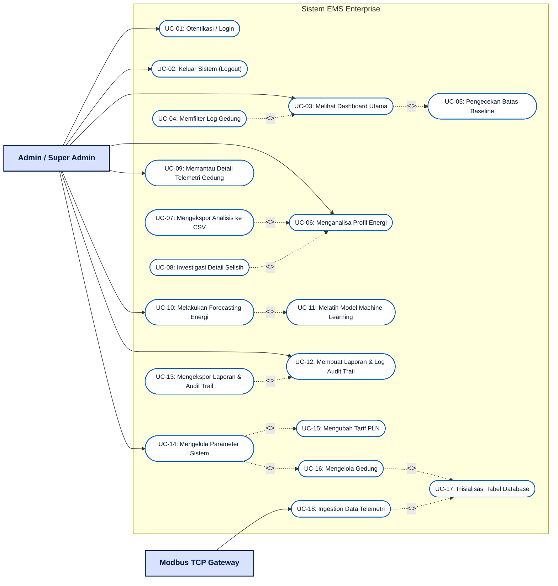
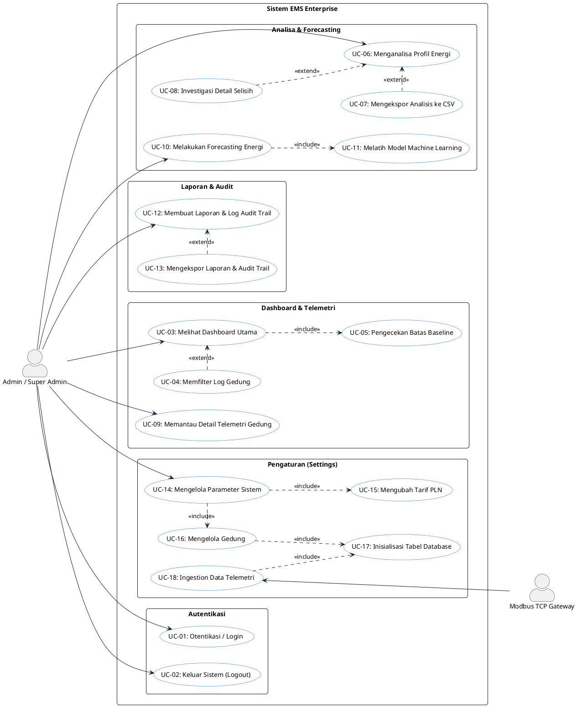

# Dokumentasi Use Case Diagram - EMS Enterprise

Dokumen ini berisi spesifikasi fungsionalitas dan diagram use case untuk **EMS Enterprise (Sistem Pemantauan Energi Gedung)**. Analisis ini dibuat berdasarkan hasil pemindaian kode sumber (`app.py`), database (`ems.db`), dan data simulator Modbus.

---

## 1. Identifikasi Aktor (Actors)

Sistem EMS Enterprise berinteraksi dengan tiga aktor utama:

| Aktor | Tipe | Deskripsi |
| :--- | :--- | :--- |
| **Admin** | Human (Aktor Utama) | Pengguna dengan peran Admin yang memantau konsumsi energi, melakukan analisis, menggunakan fitur forecasting, mengekspor laporan, serta mengubah pengaturan dasar sistem (tarif PLN, target baseline, kategori beban, dan penambahan gedung). |
| **Super Admin** | Human (Aktor Utama) | Pengguna dengan peran Super Admin yang memiliki hak akses penuh terhadap seluruh fitur pemantauan dan administrasi sistem (setara dengan Admin pada versi ini). |
| **Modbus TCP Gateway** | System/Device (Aktor Pendukung) | Gateway eksternal (disimulasikan oleh thread background) yang secara periodik mengirimkan data telemetri listrik (*Active Power kW*, *Energy kWh*, *Phase Voltage*, *Phase Current*, *Frequency*) dari masing-masing gedung ke database `ems.db`. |

---

## 2. Daftar Use Case & Spesifikasi

Berikut adalah pemetaan fungsi-fungsi sistem ke dalam Use Case:

### A. Fitur Inti & Monitoring
1. **Otentikasi / Login**: Mengakses sistem menggunakan username dan password sesuai peran (*Admin* atau *Super Admin*).
2. **Melihat Dashboard Utama**: Memantau ringkasan real-time total konsumsi (kWh), estimasi biaya (Rupiah), status baseline (Normal/Warning), grafik konsumsi harian, distribusi beban (AC, Lighting, Equipment), dan log aktivitas Modbus.
3. **Mencari / Memfilter Log Gedung**: Memfilter data tabel aktivitas gedung berdasarkan nama gedung atau nomor port Modbus pada dashboard.
4. **Membaca Profil & Telemetri Detail Gedung**: Melihat status online, grafik tegangan (Phase R/S/T), arus (Phase R/S/T), serta beban daya aktif historis untuk gedung yang dipilih.

### B. Analisa & Forecasting
5. **Menganalisa Profil Energi**: Membandingkan penggunaan energi antar periode waktu (7 hari, 30 hari, bulanan, atau kustom) dengan benchmark pembanding (minggu lalu, tahun lalu, atau target baseline).
6. **Mengekspor Analisis ke CSV**: Mengunduh data hasil perbandingan analisis profil energi ke file format `.csv`.
7. **Menginvestigasi Detail Selisih Energi**: Membuka overlay analisis wawasan AI/anomali untuk mencari penyebab lonjakan energi di periode tertentu.
8. **Melakukan Forecasting Energi (AI/ML)**: Memprediksi beban listrik (*Active Power kW*) untuk 24 jam atau 7 hari ke depan menggunakan model regresi *Random Forest*, lengkap dengan skor akurasi ($R^2$ & RMSE) serta rekomendasi manajemen beban (AI Insights).

### C. Laporan, Audit & Pengaturan
9. **Membuat Laporan & Log Audit Trail**: Menampilkan laporan audit keuangan BPK, efisiensi bulanan, rekapitulasi konsumsi gedung, serta memantau log audit trail transaksi energi.
10. **Mengekspor Laporan & Audit Trail**: Mengunduh dokumen laporan atau log audit trail dalam format CSV.
11. **Mengelola Parameter Sistem (Admin Settings)**:
    - **Mengubah Tarif PLN**: Memperbarui harga dasar listrik per kWh (Default: Rp 1.350).
    - **Memantau Status Gateway**: Memeriksa konektivitas real-time port Modbus TCP (Port 502, 503, 504).
    - **Mengatur Batas Baseline**: Menentukan target batas baseline konsumsi energi tahunan/bulanan/harian.
    - **Mengelola Kategori Beban**: Menambah atau menghapus kategori beban alat listrik (AC, Lighting, Equipment, dll.).
    - **Mengelola Gedung**: Menambah atau menghapus gedung operasional, serta menginisialisasi tabel pembacaan telemetri baru secara dinamis di database `ems.db`.
12. **Keluar Sistem (Logout)**: Menutup sesi aktif dan kembali ke halaman login.

---

## 3. Hubungan Relasi Use Case (Include / Extend)

* **`<<include>>`**:
  * Use Case **Melihat Dashboard Utama** mencakup (*includes*) pengecekan status baseline otomatis untuk mendeteksi apakah beban melebihi batas yang ditentukan.
  * Use Case **Melakukan Forecasting Energi** mencakup (*includes*) proses pelatihan model *Random Forest Regressor* menggunakan data histori telemetri.
  * Use Case **Mengelola Gedung** mencakup (*includes*) pembuatan tabel pembacaan telemetri Modbus baru secara otomatis di SQLite jika gedung baru ditambahkan.
* **`<<extend>>`**:
  * Use Case **Mencari / Memfilter Log Gedung** memperluas (*extends*) fungsionalitas **Melihat Dashboard Utama** secara opsional.
  * Use Case **Mengekspor Analisis ke CSV** dan **Menginvestigasi Detail Selisih** memperluas (*extends*) fungsionalitas **Menganalisa Profil Energi**.
  * Use Case **Mengekspor Laporan & Audit Trail** memperluas (*extends*) fungsionalitas **Membuat Laporan & Log Audit Trail**.

---

## 4. Diagram Use Case (Mermaid)

Berikut adalah visualisasi Use Case Diagram menggunakan Mermaid. Diagram ini membagi area fungsional berdasarkan modul navigasi utama di EMS Enterprise.

---

## 5. Skenario Jalannya Fitur Utama (Use Case Scenarios)

### A. Skenario: Menambahkan Gedung Baru dan Memulai Telemetri
1. **Admin** masuk ke halaman **Admin Settings**.
2. **Admin** mengisi formulir *Tambah Gedung Baru* dengan mengisi "Nama Gedung" dan "Nomor Port Modbus" (contoh: Port `505`).
3. Sistem memproses penambahan gedung (**Mengelola Gedung**).
4. Sistem secara otomatis menjalankan perintah SQL `CREATE TABLE IF NOT EXISTS device_port_505_readings (...)` untuk menyiapkan wadah data telemetri (**Inisialisasi Tabel Database**).
5. Sistem menyisipkan baris inisiasi kosong pertama agar sistem tidak mengalami crash saat dibaca pertama kali.
6. Aktor **Modbus TCP Gateway** mendeteksi port baru ini dan mulai menyisipkan data telemetri simulasi secara periodik setiap 2 detik ke tabel tersebut (**Ingestion Data Telemetri**).

### B. Skenario: Melakukan Forecasting Energi
1. **Admin** masuk ke halaman **Forecasting**.
2. **Admin** memilih gedung yang ingin diprediksi dan rentang waktu prediksi (24 Jam atau 7 Hari).
3. Sistem memicu fungsi `train_forecast_model()` (**Melatih Model Machine Learning**).
4. Model *Random Forest* mengambil data histori dari database SQLite, melakukan pemisahan data latih/uji (80:20), menghitung skor $R^2$ & RMSE, lalu melatih model pada keseluruhan data.
5. Sistem menampilkan grafik garis yang menghubungkan data aktual masa lalu dengan garis proyeksi masa depan (**Melakukan Forecasting Energi**).
6. Sistem menampilkan wawasan AI (*AI Insights*) untuk memberikan rekomendasi tindakan mitigasi jika dideteksi adanya potensi kelebihan beban baseline.

---

## 6. Kode Script PlantUML (Untuk StarUML / PlantText)

Berikut adalah kode script PlantUML yang dapat Anda salin dan tempel langsung ke **StarUML** (yang mendukung impor PlantUML), **PlantText**, atau editor PlantUML lainnya untuk menghasilkan Use Case Diagram UML secara otomatis:

---

## 7. Panduan Mengatur Garis Lurus & Rapi di StarUML

Jika Anda menggambar atau mengimpor Use Case ini di **StarUML**, garis-garis hubungan seringkali meliuk-liuk secara tidak rapi. Ikuti langkah berikut agar semua garis lurus dan rapi:

### 1. Mengubah Tipe Garis Menjadi Lurus (90 Derajat atau Diagonal Langsung)
Secara default, StarUML menggunakan tipe garis melengkung/bebas. Anda bisa mengubahnya menjadi **Rectilinear** (siku-siku 90 derajat) atau **Oblique** (lurus langsung tanpa belokan):
* **Cara Cepat (Semua Garis):** 
  1. Tekan tombol `Ctrl + A` pada keyboard untuk menyeleksi seluruh diagram.
  2. Buka menu utama di bagian atas: **Format** -> **Line Style**.
  3. Pilih **Oblique** jika Anda ingin garis lurus diagonal langsung (point-to-point).
  4. Pilih **Rectilinear** jika Anda ingin garis siku-siku 90 derajat yang rapi (hanya bergerak horizontal dan vertikal).

### 2. Merapikan Posisi Elemen (Align & Distribute)
Agar garis tidak saling silang, posisikan aktor dan usecase secara simetris:
* **Tata Letak Standar:**
  * Tempatkan Aktor **Admin / Super Admin** di ujung paling **Kiri**.
  * Tempatkan Aktor **Modbus TCP Gateway** di ujung paling **Kanan**.
  * Tempatkan seluruh elips **Usecase** di bagian **Tengah** (di dalam kotak batas sistem).
* **Menggunakan Alat Perata Otomatis (Alignment):**
  1. Seleksi elips usecase yang ingin Anda sejajarkan (klik sambil tahan tombol `Shift`).
  2. Klik kanan pada area seleksi, lalu pilih **Alignment** -> **Align Center (Vertically)** untuk membuat mereka berbaris lurus vertikal dari atas ke bawah.
  3. Pilih **Alignment** -> **Distribute Vertically** agar jarak antar elips usecase dari atas ke bawah sama rata secara presisi.

