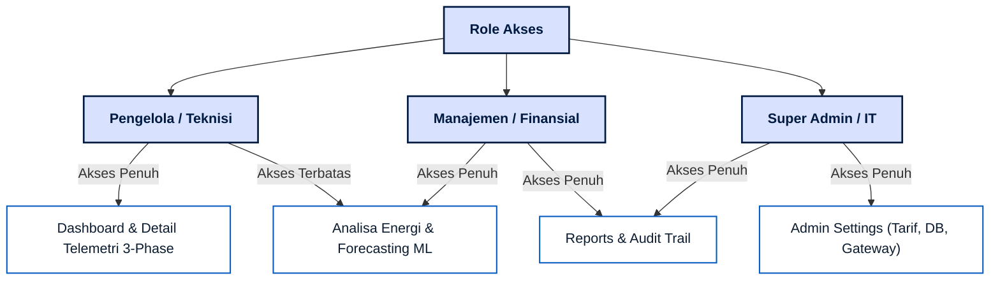

# Analisis Perbedaan Kebutuhan Pengguna (User Requirements) - EMS Enterprise

Dalam implementasi nyata di lingkungan industri/korporat, pengguna sistem **EMS Enterprise** umumnya dibagi menjadi beberapa peran (personas) sesuai tanggung jawab mereka. Berikut adalah pembagian peran, kebutuhan utama, dan modul sistem yang relevan bagi masing-masing pihak:

---

## 1. Matriks Perbandingan Peran & Kebutuhan (User Requirements Matrix)

| Dimensi Perbandingan | Pengelola Gedung (Teknisi / Operator Fasilitas) | Manajemen Gedung (Manajer Energi / Direksi / Keuangan) | Super Admin (IT / System Administrator) |
| :--- | :--- | :--- | :--- |
| **Fokus Utama** | Operasional harian di lapangan, kestabilan jaringan listrik, dan respon cepat terhadap gangguan/alarm. | Efisiensi biaya, pencapaian target efisiensi energi (KPI), audit finansial, dan perencanaan anggaran (budgeting). | Konfigurasi sistem dasar, keamanan data, integrasi perangkat Modbus, dan pemeliharaan database. |
| **Kebutuhan Informasi** | - Nilai tegangan (V) & arus (A) per phase. - Status koneksi gateway Modbus. - Peringatan *overshoot* beban secara real-time. | - Total konsumsi akumulatif (kWh). - Estimasi biaya tagihan (Rupiah). - Laporan kepatuhan audit (BPK/Internal). - Tren proyeksi beban (Forecasting). | - Konfigurasi tarif PLN. - Pemetaan alamat IP/Port Modbus. - Manajemen database dan log audit sistem. |
| **Tingkat Detail Data** | Sangat detail, bersifat teknis, dan berorientasi pada waktu nyata (*seconds/minutes*). | Agregat (ringkasan), berorientasi finansial, dan jangka panjang (*daily/monthly/yearly*). | Parameter konfigurasi sistem dan integritas infrastruktur data. |

---

## 2. Rincian Kebutuhan & Use Case Per Peran

### A. Pengelola Gedung (Teknisi / Operator Lapangan)
Teknisi memerlukan visualisasi data mentah yang mengalir langsung dari sensor/power meter untuk memantau kesehatan instalasi listrik 3-phase di masing-masing gedung.

* **Fitur Utama yang Sering Digunakan:**
  * **Dashboard Utama (Real-time):** Memantau status beban aktif (kW) saat ini untuk mendeteksi *overshoot*.
  * **Profile Gedung (Detail Telemetri):** Memantau fluktuasi grafik tegangan (Voltage Phase R-N, S-N, T-N) dan arus (Current Phase R, S, T) guna mendeteksi ketidakseimbangan beban antar phase.
  * **Admin Settings (Status Gateway):** Memantau apakah perangkat Modbus di gedung 1, 2, atau 3 mengalami putus koneksi (offline).
* **Skenario Tindakan:**
  * Jika muncul **Warning** pada dashboard yang menunjukkan konsumsi melewati baseline, pengelola gedung akan menelusuri grafik telemetri 3-phase untuk mencari klaster beban yang tidak normal dan melakukan tindakan pemadaman atau pembatasan manual di lapangan.

---

### B. Manajemen Gedung (Manajer Energi / Direktur Keuangan / Auditor)
Manajemen tidak berfokus pada detail tegangan per phase, melainkan pada dampak finansial dari konsumsi energi tersebut serta kepatuhannya terhadap regulasi/anggaran perusahaan.

* **Fitur Utama yang Sering Digunakan:**
  * **Analisa Profil Energi:** Membandingkan kinerja pemakaian listrik bulan ini vs bulan lalu atau target baseline tahunan guna mengukur keberhasilan program hemat energi.
  * **Forecasting Energi (AI/ML):** Memanfaatkan visualisasi prediksi beban untuk melakukan *peak-shaving* (misal: menyalakan mesin berdaya besar di luar jam beban puncak untuk meminimalkan tagihan).
  * **Reports & Audit:** Mengunduh laporan rekapitulasi energi bulanan atau Laporan Audit Keuangan (BPK) untuk kebutuhan pelaporan direksi.
* **Skenario Tindakan:**
  * Di akhir bulan, manajer keuangan membuka menu **Reports & Audit**, menyaring jenis laporan "Audit Keuangan (BPK)", melihat angka pengeluaran dalam Rupiah, lalu mengekspornya ke CSV untuk diolah menjadi bahan presentasi rapat direksi mengenai performa biaya operasional gedung.

---

### C. Super Admin (IT / System Administrator)
Super Admin bertindak sebagai pemelihara sistem (enabler) agar aplikasi EMS tetap berjalan dengan konfigurasi yang tepat dan aman.

* **Fitur Utama yang Sering Digunakan:**
  * **Admin Settings (Tarif & Batas Baseline):** Menyesuaikan harga tarif per kWh jika PLN mengubah struktur harga dasar listrik nasional.
  * **Admin Settings (Manajemen Gedung & Tabel DB):** Menambahkan gedung operasional baru (misal: "Gedung 4" dengan Port `505`). Fitur ini secara otomatis menginisialisasi skema tabel database SQLite baru tanpa harus menulis query SQL secara manual.
  * **Reports & Audit (Audit Trail):** Memantau siapa yang mengubah tarif, siapa yang menghapus kategori, atau melacak log aktivitas admin demi keamanan sistem.
* **Skenario Tindakan:**
  * Ketika ada perluasan gedung baru di area pabrik, IT admin memasukkan parameter gedung tersebut ke sistem, memastikan power meter terhubung ke Port Modbus yang ditentukan, dan memverifikasi tabel telemetry baru berhasil di-generate di database `ems.db`.

---

## 3. Rekomendasi Pemisahan Hak Akses (Role-Based Access Control)
Meskipun dalam kode sumber `app.py` saat ini menu navigasi masih terbuka penuh untuk semua peran demi fleksibilitas simulasi, untuk pengembangan ke depan disarankan menerapkan pembatasan hak akses menu sebagai berikut:

