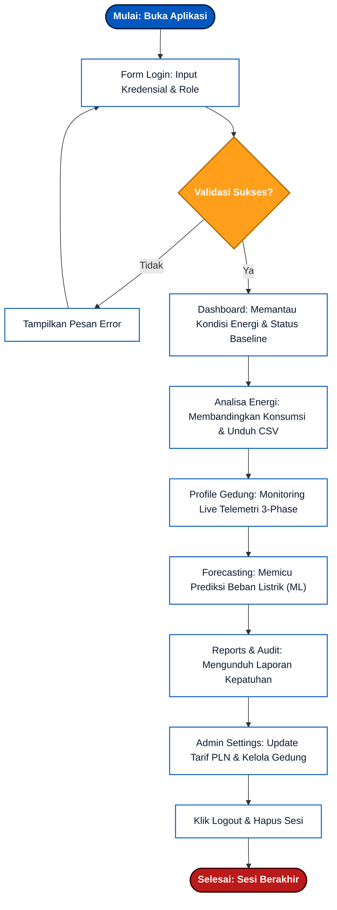
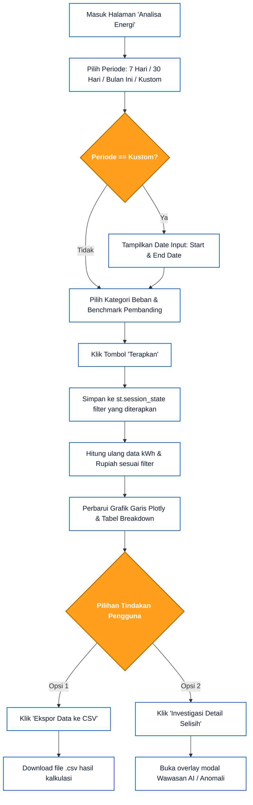
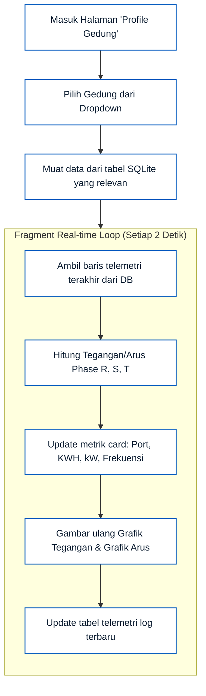
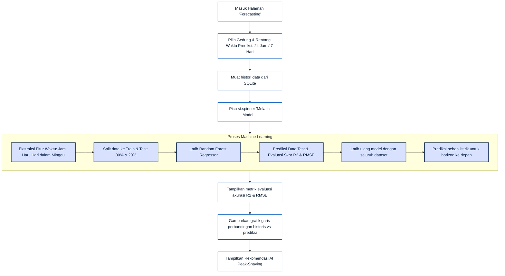
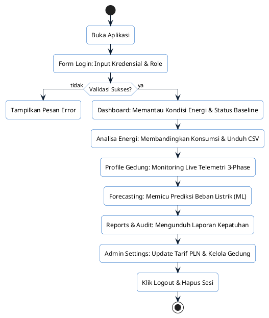
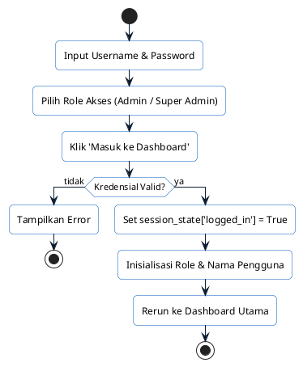
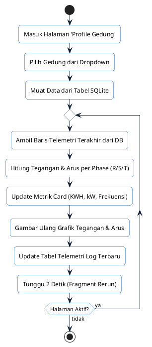
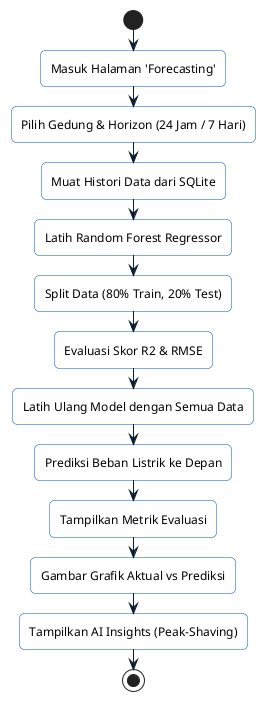

# Dokumentasi User Flow - EMS Enterprise

Dokumen ini menjelaskan alur perjalanan pengguna (User Flow) saat menggunakan sistem **EMS Enterprise (Sistem Pemantauan Energi Gedung)**. Alur ini memandu bagaimana pengguna berinteraksi dengan antarmuka Streamlit, mengalirkan data, dan mengoperasikan fitur-fitur analisis dari halaman awal hingga pengaturan administrasi.

---

## 1. Peta Navigasi Global (Global User Flow)

Berikut adalah bagan alir navigasi utama yang menggambarkan pintu masuk pengguna ke dalam aplikasi dan opsi menu yang tersedia setelah berhasil login.



---

## 2. Alur Detail Per Fitur (Detail Flows)

Berikut adalah rincian langkah demi langkah dari setiap fungsi utama aplikasi:

### A. Alur Otentikasi & Login (Authentication Flow)
Alur ini menjamin bahwa hanya pengguna terdaftar (*Admin* dengan username `admin` atau *Super Admin* dengan username `superadmin`) yang dapat masuk ke panel dashboard.

```mermaid
graph TD
    classDef step fill:#ffffff,stroke:#0058be,stroke-width:1.5px,color:#0b1c30;
    classDef check fill:#ff9f1c,stroke:#b36b00,stroke-width:2px,color:#ffffff,font-weight:bold;

    A[Input Username & Password]:::step --> B[Pilih Role Akses: Admin / Super Admin]:::step
    B --> C[Klik 'Masuk ke Dashboard']:::step
    C --> D{"Apakah Kredensial Valid?"}:::check
    D -- Ya --> E[Set st.session_state['logged_in'] = True]:::step
    E --> F[Inisialisasi Role & Nama Pengguna]:::step
    F --> G[Rerun halaman ke Dashboard Utama]:::step
    D -- Tidak --> H[Tampilkan st.error]:::step
    H --> A
```

---

### B. Alur Analisa Profil Energi (Energy Analysis Flow)
Pada modul **Analisa Energi**, pengguna dapat menyaring data histori penggunaan energi berdasarkan rentang waktu, kategori beban, dan pembanding.



---

### C. Alur Pemantauan Detail Telemetri (Building Profile Flow)
Alur ini berjalan secara real-time. Data diperbarui secara dinamis setiap 2 detik menggunakan fitur `st.fragment` dari Streamlit.



---

### D. Alur Forecasting Beban Energi (Machine Learning Flow)
Di modul **Forecasting**, pengguna melatih model *Random Forest* untuk memproyeksikan konsumsi daya listrik gedung di masa mendatang.



---

### E. Alur Pengelolaan Parameter & Gedung (Admin Settings Flow)
Pengaturan administrasi memungkinkan modifikasi parameter tarif, batas baseline, serta struktur kategori dan gedung.

```mermaid
graph TD
    classDef step fill:#ffffff,stroke:#0058be,stroke-width:1.5px,color:#0b1c30;
    classDef db fill:#f1f5f9,stroke:#94a3b8,stroke-width:2px,color:#334155;
    classDef check fill:#ff9f1c,stroke:#b36b00,stroke-width:2px,color:#ffffff,font-weight:bold;

    A[Masuk Halaman 'Admin Settings']:::step --> B{Pilih Blok Konfigurasi}:::check
    
    %% Jalur Tarif
    B -->|1. Tarif PLN| C[Masukkan Nilai Tarif per kWh]:::step
    C --> D[Klik 'Simpan Perubahan Tarif PLN']:::step
    D --> E[Perbarui st.session_state['tarif_pln'] secara global]:::step
    
    %% Jalur Target Baseline
    B -->|2. Target Baseline| F[Pilih Tipe Rentang & Batas kWh]:::step
    F --> G[Klik 'Simpan Target']:::step
    G --> H[Perbarui st.session_state['batas_angka']]:::step
    
    %% Jalur Gedung Baru
    B -->|3. Tambah Gedung| I[Input Nama Gedung & Nomor Port Modbus]:::step
    I --> J[Klik 'Tambah Gedung']:::step
    J --> K[Hubungkan ke ems.db]:::db
    K --> L[Jalankan CREATE TABLE device_port_XXX_readings]:::db
    L --> M[Masukkan baris telemetri inisiasi pertama]:::db
    M --> N[Tambahkan ke st.session_state['gedung_list']]:::step
    N --> O[Picu st.rerun untuk memuat gedung baru]:::step
```

---

## 3. Kode Script PlantUML untuk User Flow (StarUML / PlantText)

Berikut adalah kode script PlantUML (Activity Diagram) yang dapat Anda gunakan di **StarUML**, **PlantText**, atau editor PlantUML lainnya untuk me-render User Flow secara otomatis dengan garis yang lurus dan rapi:

### A. Global User Flow (Alur Navigasi Utama)


### B. Alur Detail Login


### C. Alur Detail Analisa Energi
```plantuml
@startuml
skinparam roundcorner 10
skinparam ActivityBackgroundColor White
skinparam ActivityBorderColor #0058be
skinparam ArrowColor #0b1c30

start
:Masuk Halaman 'Analisa Energi';
:Pilih Periode;
if (Periode == Kustom?) then (ya)
  :Tampilkan Input Tanggal (Start & End);
else (tidak)
endif
:Pilih Kategori Beban & Benchmark;
:Klik Tombol 'Terapkan';
:Simpan Filter ke Session State;
:Hitung Ulang kWh & Rupiah;
:Perbarui Grafik Plotly & Tabel Breakdown;
split
  :Klik 'Ekspor Data ke CSV';
  :Unduh File CSV;
split currents
  :Klik 'Investigasi Detail Selisih';
  :Buka Modal Wawasan AI / Anomali;
end split
stop
@enduml
```

### D. Alur Detail Profile Gedung


### E. Alur Detail Forecasting


### F. Alur Detail Admin Settings
```plantuml
@startuml
skinparam roundcorner 10
skinparam ActivityBackgroundColor White
skinparam ActivityBorderColor #0058be
skinparam ArrowColor #0b1c30

start
:Masuk Halaman 'Admin Settings';
split
  :1. Tarif PLN;
  :Masukkan Nilai Tarif per kWh;
  :Klik 'Simpan Perubahan Tarif';
  :Update tarif_pln Global;
split currents
  :2. Target Baseline;
  :Pilih Rentang & Batas kWh;
  :Klik 'Simpan Target';
  :Update batas_angka Global;
split currents
  :3. Tambah Gedung;
  :Input Nama & Port Modbus;
  :Klik 'Tambah Gedung';
  :CREATE TABLE device_port_XXX_readings;
  :Insert Baris Inisiasi DB;
  :Tambahkan ke gedung_list;
  :Picu st.rerun;
end split
stop
@enduml
```

