# Dokumentasi User Flow — EMS Enterprise (Per Role)

Dokumen ini menjelaskan alur perjalanan pengguna (User Flow) saat menggunakan sistem **EMS Enterprise (Sistem Pemantauan Energi Gedung)**. Alur ini dibagi berdasarkan **dua role** yang memiliki hak akses berbeda.

---

## 1. Definisi Role & Hak Akses

| Role | Jabatan | Hak Akses Sidebar |
| :--- | :--- | :--- |
| **Super Admin** | Manajemen Gedung | Dashboard, Analisa Energi, Profile Gedung, **Forecasting**, **Reports & Audit**, **Admin Settings** |
| **Admin** | Pengelola Gedung | Dashboard, Analisa Energi, Profile Gedung |

> **Catatan:** Admin (Pengelola Gedung) tidak melihat menu Forecasting, Reports & Audit, dan Admin Settings di sidebar. Pembatasan ini bersifat *structural* — menu tidak ditampilkan, bukan hanya di-disable.

---

## 2. Peta Navigasi Global (Per Role)

### 2A. Super Admin — Manajemen Gedung (Akses Penuh)

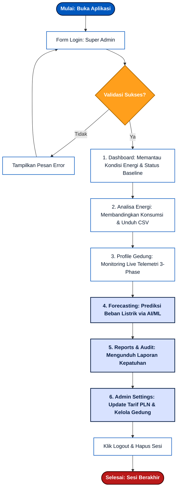

### 2B. Admin — Pengelola Gedung (Akses Terbatas)

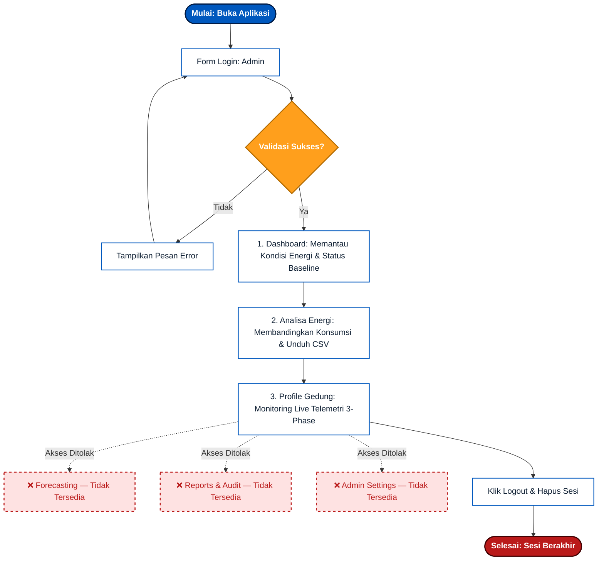

---

## 3. Alur Detail Per Fitur

### A. Alur Otentikasi & Login (Kedua Role)

Alur ini menjamin bahwa hanya pengguna terdaftar (*Admin* dengan username `admin` atau *Super Admin* dengan username `superadmin`) yang dapat masuk ke panel dashboard. Setelah login, sidebar menampilkan menu sesuai role.

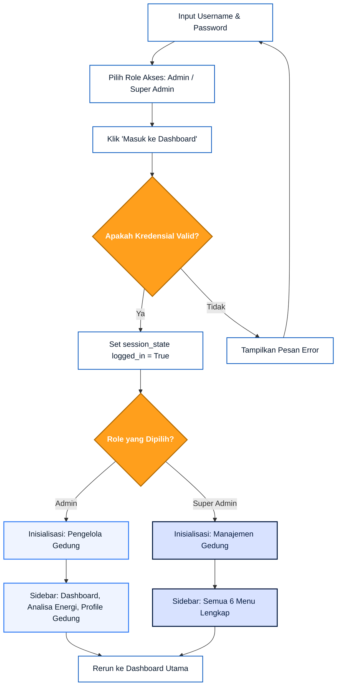

---

### B. Alur Analisa Profil Energi (Super Admin & Admin)

Pada modul **Analisa Energi**, pengguna dapat menyaring data histori penggunaan energi berdasarkan rentang waktu, kategori beban, dan pembanding.

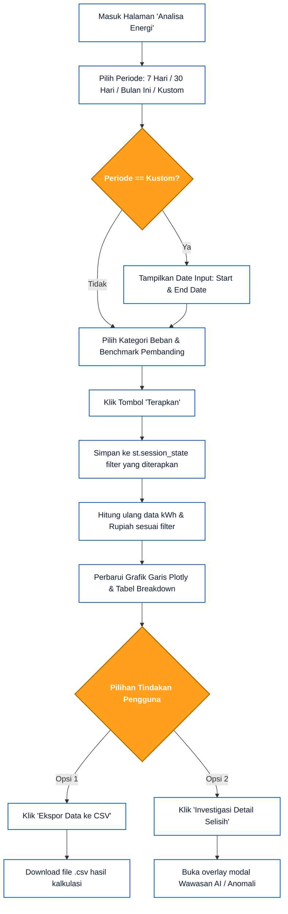

---

### C. Alur Pemantauan Detail Telemetri (Super Admin & Admin)

Alur ini berjalan secara real-time. Data diperbarui secara dinamis setiap 2 detik menggunakan fitur `st.fragment` dari Streamlit.

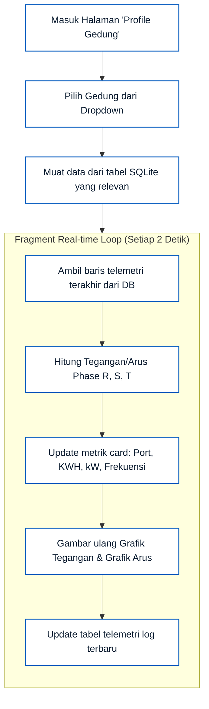

---

### D. Alur Forecasting Beban Energi — ⚠️ Khusus Super Admin

Di modul **Forecasting**, pengguna melatih model *Random Forest* untuk memproyeksikan konsumsi daya listrik gedung di masa mendatang. **Fitur ini hanya tersedia untuk Super Admin (Manajemen Gedung).**

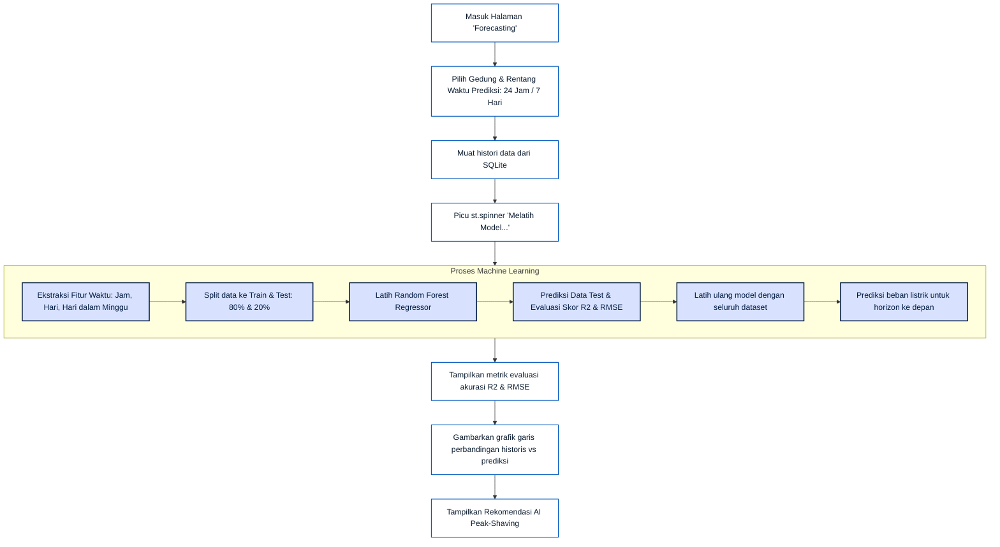

---

### E. Alur Reports & Audit — ⚠️ Khusus Super Admin

Modul pelaporan dan audit trail. **Hanya tersedia untuk Super Admin (Manajemen Gedung).**

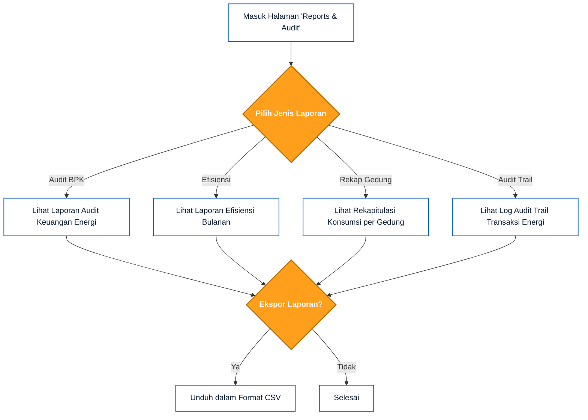

---

### F. Alur Pengelolaan Parameter & Gedung — ⚠️ Khusus Super Admin

Pengaturan administrasi memungkinkan modifikasi parameter tarif, batas baseline, serta struktur kategori dan gedung. **Hanya tersedia untuk Super Admin (Manajemen Gedung).**

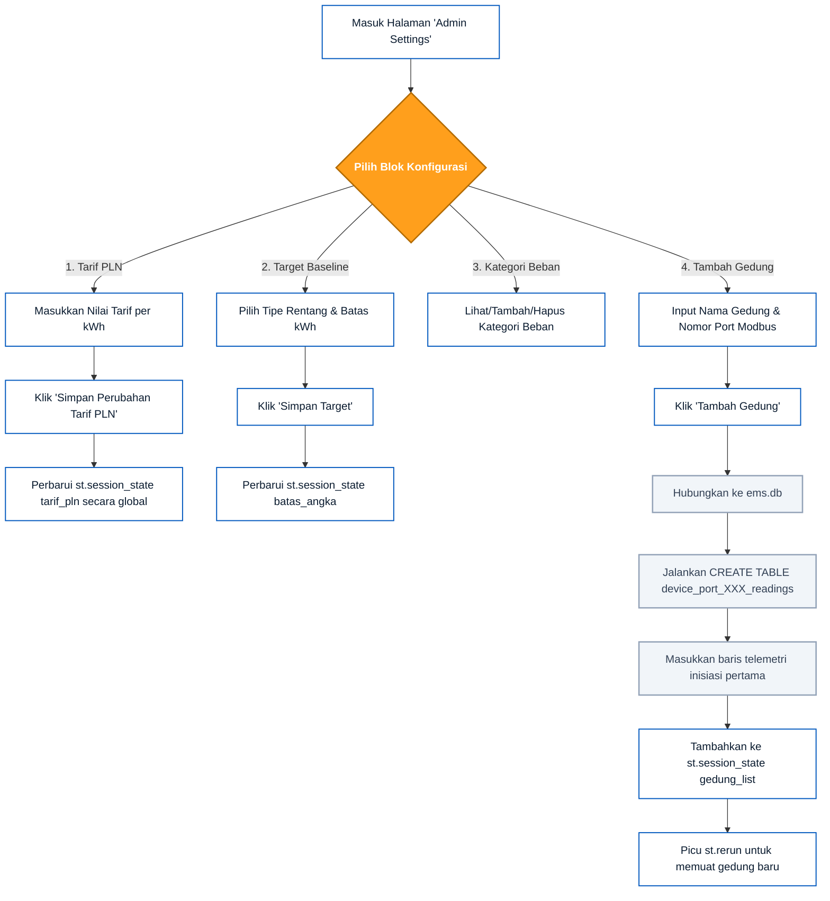

---

## 4. Kode Script PlantUML (Untuk StarUML / PlantText)

### A. User Flow Super Admin (Manajemen Gedung)
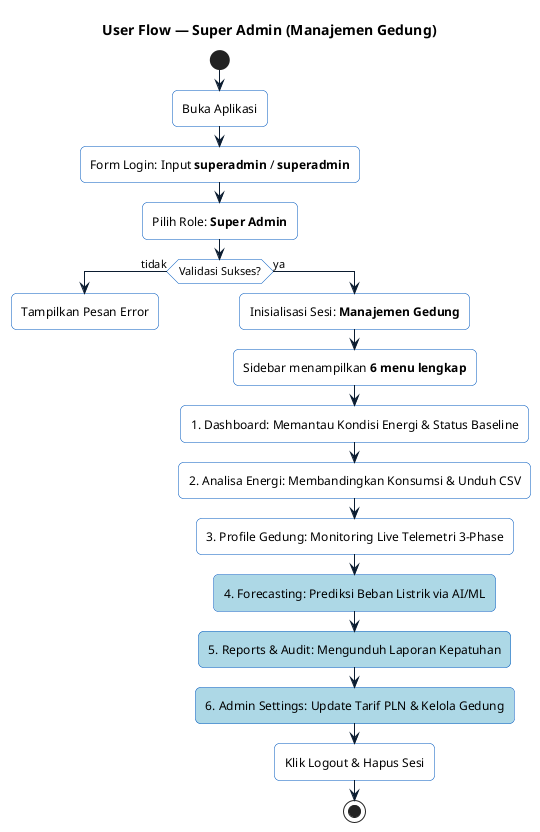

### B. User Flow Admin (Pengelola Gedung)
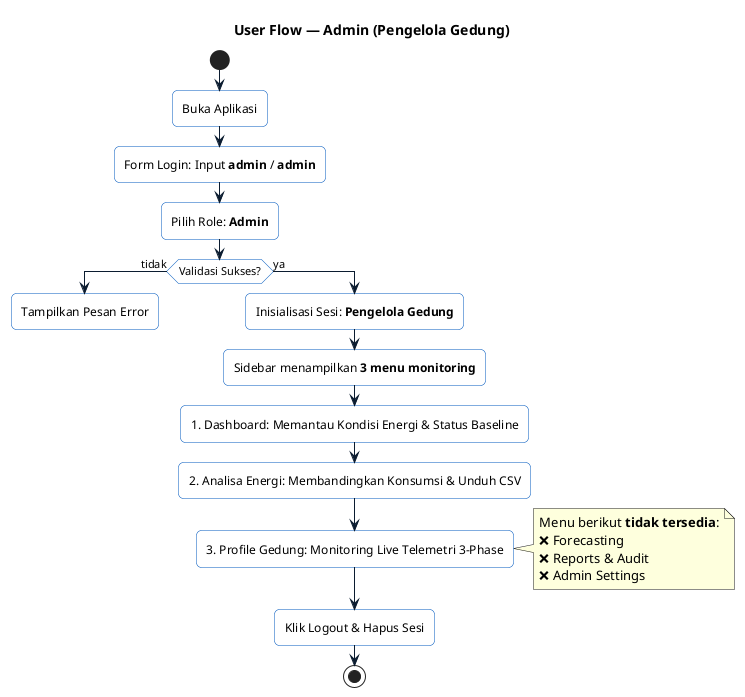

### C. Alur Detail Login (Kedua Role)
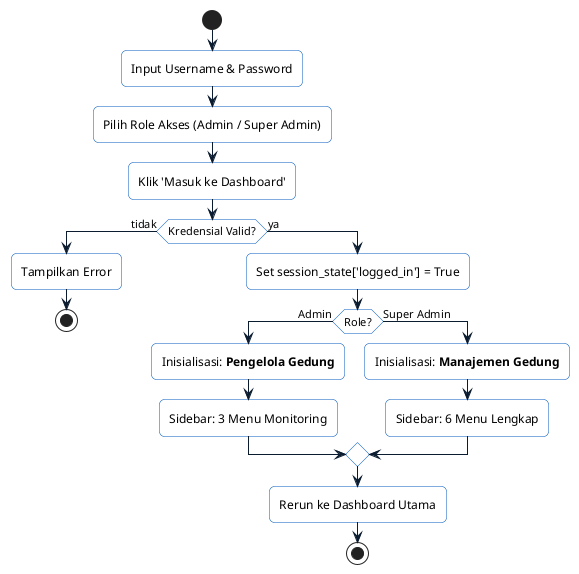

### D. Alur Detail Analisa Energi
```plantuml
@startuml
skinparam roundcorner 10
skinparam ActivityBackgroundColor White
skinparam ActivityBorderColor #0058be
skinparam ArrowColor #0b1c30

start
:Masuk Halaman 'Analisa Energi';
:Pilih Periode;
if (Periode == Kustom?) then (ya)
  :Tampilkan Input Tanggal (Start & End);
else (tidak)
endif
:Pilih Kategori Beban & Benchmark;
:Klik Tombol 'Terapkan';
:Simpan Filter ke Session State;
:Hitung Ulang kWh & Rupiah;
:Perbarui Grafik Plotly & Tabel Breakdown;
split
  :Klik 'Ekspor Data ke CSV';
  :Unduh File CSV;
split currents
  :Klik 'Investigasi Detail Selisih';
  :Buka Modal Wawasan AI / Anomali;
end split
stop
@enduml
```

### E. Alur Detail Profile Gedung
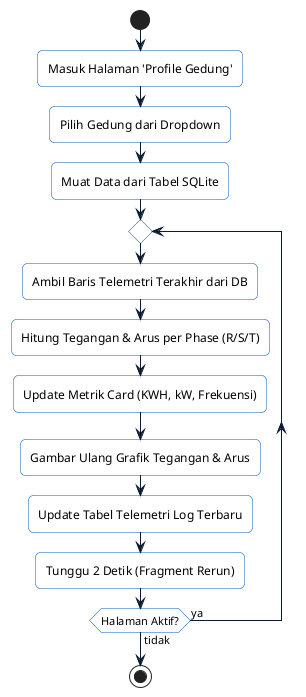

### F. Alur Detail Forecasting (Super Admin Only)
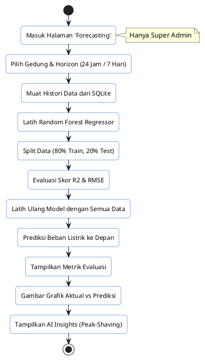

### G. Alur Detail Admin Settings (Super Admin Only)
```plantuml
@startuml
skinparam roundcorner 10
skinparam ActivityBackgroundColor White
skinparam ActivityBorderColor #0058be
skinparam ArrowColor #0b1c30

start
:Masuk Halaman 'Admin Settings';
note right: Hanya Super Admin
split
  :1. Tarif PLN;
  :Masukkan Nilai Tarif per kWh;
  :Klik 'Simpan Perubahan Tarif';
  :Update tarif_pln Global;
split currents
  :2. Target Baseline;
  :Pilih Rentang & Batas kWh;
  :Klik 'Simpan Target';
  :Update batas_angka Global;
split currents
  :3. Kategori Beban;
  :Lihat/Tambah/Hapus Kategori;
split currents
  :4. Manajemen Gedung;
  :Input Nama & Port Modbus;
  :Klik 'Tambah Gedung';
  :CREATE TABLE device_port_XXX_readings;
  :Insert Baris Inisiasi DB;
  :Tambahkan ke gedung_list;
  :Picu st.rerun;
end split
stop
@enduml
```


